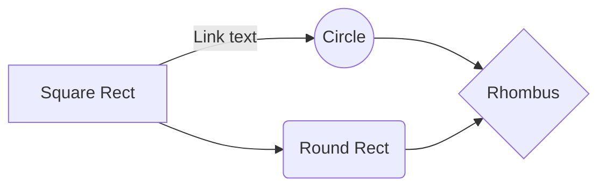

# HelloAVR
 ![Schematic Capture image of the Project]
 /assets/HelloAVR_ Schematic_Capture.SVG
 
 /../main/assets/images/electrocat.png
assets/HelloAVR_ Schematic_Capture.SVG

And this will produce a flow chart:

